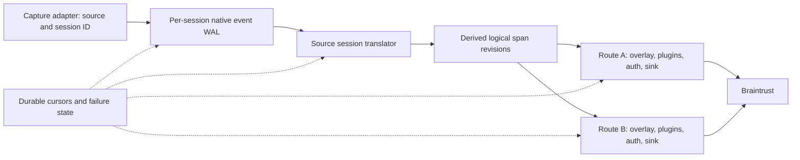

# Agent event WAL and failure recovery

Status: draft for review. This is a proposed replacement for the plugin-specific
recovery machinery in [draft PR #130](https://github.com/braintrustdata/braintrust-coding-agent-plugins/pull/130).
It does not describe behavior already implemented by that PR.

## Purpose and governing rules

The daemon should retain a complete, ordered record of every native event it
accepts from a coding-agent capture adapter. The translator reads that record
and produces Braintrust spans to the best of its ability. A translator's current
interests and schema knowledge must not decide which native fields or events
survive in the journal.

The recovery system should stop only the work that cannot safely progress,
identify the reason, and resume from the exact failed position when that
reason may have changed. A plugin failure should stop its delivery route; a
translation failure should stop translation for its source session. Other
sessions, and routes that have no failure, should continue.

These are the proposed invariants:

1. A hook is acknowledged only after its native event is recorded in the
   capture WAL. Auth, translation, plugin execution, and backend delivery are
   downstream work.
2. The captured native event is retained without dropping fields, filtering
   event names, or substituting a translator's reduced representation.
   Compression and external payload storage are acceptable only when they
   reconstruct the captured event losslessly.
   `source` and a nonempty `session_id` are the required capture identity;
   they select the session WAL partition. No other native payload shape is
   required before append.
3. Unknown or intentionally unused events are journaled and consumed without
   producing spans or pausing progress. A **recognized** event whose required
   structure cannot be interpreted safely is a translation failure.
4. A failure never advances the affected progress cursor past the first
   unprocessed event or undelivered span operation. Later native events still
   enter the WAL.
5. Retry conditions are specific to the recorded failure. A check only makes
   replay eligible; replay and acknowledged delivery determine whether the
   failure has actually been resolved.
6. A recovered span has the same current fields it would have had on an
   uninterrupted delivery. Failure indicators exist only while the failure is
   active. The local diagnostic history can retain resolved incidents.
7. Credentials are resolved at delivery time and are never stored in the
   native-event WAL or a persisted recovery condition.

"Complete" here means complete for events delivered to the capture adapter.
The daemon cannot reconstruct events an agent never exposes. The retention
lifetime of captured events is a separate product decision below.

## Current seams that this design replaces

The current daemon already appends an envelope before acknowledging `event.log`,
and it keeps a source-qualified session journal with route-specific delivery
checkpoints. It also records plugin failures and retries their route after the
failed plugin file changes. The proposed model preserves those useful
boundaries while replacing several constraints:

| Current behavior | Required change |
| --- | --- |
| `capture_hook` extracts `session_id` before it can send an envelope; JS adapters also supply an envelope `session_id`. The daemon deserializes an `Envelope` before journaling it. | Keep `source` and nonempty `session_id` as required capture metadata so the event can enter its session partition. Do not require any further native event fields or translator-specific decoding before append. |
| The journal serializes `RedactedEnvelope.payload` as `serde_json::Value`. Pi journal compaction drops some native fields from provider, streaming, and terminal events. | Preserve the complete native payload. Replace lossy Pi compaction with lossless compression or storage of the original payload. |
| `configure_event` resolves auth before `session_for` creates an actor. `SessionConfig` combines routing and credentials. | Create source-session and route work from non-secret routing information. Give translators route-neutral context and resolve credentials only for delivery. |
| Some known-event typed decoders return `None` and their callers silently emit no operations. | Distinguish unknown or unused events from known events whose required fields fail decoding. |
| `PluginRecoveryState`, `PluginPause`, and plugin diagnostics each hold part of the recovery state. | Persist one mode-neutral work state and a separate typed failure cause. Derive doctor output from incidents; retain plugin diagnostics only as bounded history and for migration. |
| Journal events are synced before acknowledgement, but native records are collected by age. | Keep accepted native WAL records for the lifetime of the data directory. Do not collect records needed by paused work or active failure history. |

Old journals remain readable during migration. Native fields that an old lossy
journal omitted cannot be reconstructed; the migration must not label those
records as complete historical captures.

## Proposed data flow



The native-event WAL is authoritative. A derived span log and snapshots are
rebuildable indexes, not replacements for it. A source session owns one
translator state machine and ordered logical span revisions. Each route owns
its destination overlay, ordered plugin chain, credentials, sink, delivery
cursor, and marker state. This avoids translating the same native session
independently for multiple destinations and confines plugin and backend
failures to their route.

The implementation rebuilds translator state by streaming the native WAL.
Replay is bounded in memory. Durable translator snapshots remain an optional
performance improvement; they are not required for correctness.

### Capture and session partitioning

The capture boundary should accept a native payload as opaque bytes or an
opaque structured value supplied by an in-process adapter, plus separately
captured non-secret metadata. `source` and a nonempty `session_id` are the
only required identity fields; the adapter may also supply its version, agent
version, receive time, route selection, managed-run ID, and process evidence.
Hook adapters extract the session ID from the native hook input using their
configured field. In-process JS adapters place the ID in the envelope; when
the agent event has no native ID, the adapter must assign one that consistently
groups that session's events. The current OpenCode adapter, for example, can
use a fallback ID. The daemon validates this identity before append and writes
directly to the `(source, session_id)` WAL partition. Missing identity is a
capture error, not a paused session: there is no trustworthy partition to
resume. Adapter-specific mistakes in assigning IDs need to be fixed at the
capture boundary.

Hook adapters that receive JSON bytes should retain those bytes; adapters
that receive an object should serialize the complete object without
translator-specific projection. Neither route metadata nor daemon-generated
credentials should be mixed into the native payload. Append a framed,
checksummed record to the selected session partition before interpreting any
other native fields. The existing per-session journal files can be migrated
into that format. The physical segment layout should support bounded append
and streaming replay.

Valid but unfamiliar native JSON is still a valid capture when the adapter
supplies `source` and `session_id`. An in-process adapter can preserve
syntactically invalid native bytes if it has that identity separately, then
translation pauses on a typed parse failure. A hook whose session ID must be
extracted from invalid JSON cannot meet the capture contract. A transport
frame that is absent or exceeds the wire size limit remains a capture error:
there is no complete event to append.

The WAL record should carry a format version, monotonic capture sequence,
length, checksum, and enough metadata to interpret the native bytes. The reader
should stop at an incomplete final record after a crash without treating
earlier records as corrupt. Unknown WAL record versions must remain available
for a newer reader instead of being deleted.

### Translation contract

The translator receives ordered native events for one source session. It
returns an explicit disposition for each record:

```rust
enum TranslationOutcome {
    Produced(Vec<LogicalSpanRevision>),
    Ignored { reason: IgnoreReason },
}

enum TranslationFailure {
    UnsupportedShape {
        source: String,
        event: String,
        source_version: Option<String>,
        translator_revision: String,
        field_path: Option<String>,
        detail: String,
    },
    Internal { translator_revision: String, detail: String },
}
```

The `Result<TranslationOutcome, TranslationFailure>` boundary is important:

- An event name the translator does not recognize is `Ignored::UnknownEvent`.
  A known event that has no trace-bearing use is `Ignored::UnusedEvent`.
  Neither blocks the stream. Both remain in the native WAL.
- A recognized event with unknown extra fields is generally supported. An
  absent or malformed optional field should be ignored when useful translation
  is still correct.
- A recognized event missing a required identity, relationship, lifecycle, or
  content field returns `UnsupportedShape`. The source session pauses before
  consuming that event. Later native events continue to be captured.
- Translator code errors are separate from native shape errors. Both are
  associated with the revision of the running translator that failed.

Each agent translator needs an explicit list of the event names it handles and
the fields that are genuinely required for each one. Existing `decode(...)
.unwrap_or_default()` and similar no-op paths should be audited one event at a
time; only required-shape failures change to errors. Do not add a blanket
strict decoder to arbitrary tool arguments, messages, provider payloads, or
metadata. A translator call must either commit its output and state transition
or fail without advancing the source translation cursor. If a failed call has
already mutated in-memory state, discard that translator instance and rebuild
it from the last committed position.

An `UnsupportedShape` incident becomes eligible for replay only when a **new
running translator revision** is available. An installed binary changing on
disk does not change code in the current process. Version handover must start a
new daemon generation or perform an internal, journal-safe process handoff; no
user-facing restart command is required. A retry that fails under the new
revision records that revision and waits for another relevant change.

### Route overlays and delivery

Logical span revisions contain deterministic source-qualified span identities
and route-neutral content. A route overlay supplies destination-specific parent
attachment, tags, metadata, and project context before its plugins run. The
sink obtains an auth lease only when it is ready to submit output. A missing
login therefore creates an ordinary delivery failure for that route; it does
not prevent actor creation, native capture, or translation.

Each route consumes the derived revision stream through its own cursor. A
plugin, credential, destination, rate-limit, or transport failure pauses that
route at the first undelivered operation. Other routes and source sessions
continue. The route does not retain an unbounded span queue in memory; it
re-reads durable revisions when it is eligible to retry. A route created after
a session has begun can backfill from the logical revision stream or rebuild it
from the native WAL while respecting its own destination and plugin chain.

Translation failure is source-session scoped because every route needs that
translator's next logical revision. Route failures are delivery scoped. The
same recovery state model serves both scopes, but their progress cursors refer
to different streams.

## Generic recovery state

`PluginRecoveryState` should be replaced by a mode-neutral representation. A
persisted incident describes what blocked one work scope, not the status of a
particular plugin:

```rust
enum WorkScope {
    SourceSession { source: String, session_id: String },
    DeliveryRoute { source: String, session_id: String, route_id: RouteId },
}

enum WorkState { Paused, Reprocessing }

struct Incident {
    id: IncidentId,
    scope: WorkScope,
    first_unprocessed: Cursor,
    cause: FailureCause,
    local_error: String,
    first_seen_ms: i64,
    last_seen_ms: i64,
    attempts: u64,
    marker_span_id: Option<String>,
}
```

The active state has no failure marker. Once work succeeds and its cursor is
durably advanced, move the incident to bounded local resolved history and set
the work state to `Active`. Doctor can show the resolution time without making
"recovered" a permanent processing mode or span field. The actor's in-memory
state is a cache of the persisted state, not a second authority.

The cursor must identify the exact boundary. A source translation cursor is a
native record ID. A route delivery cursor is a logical revision ID and
operation ordinal within it. A native event can produce multiple operations;
checkpointing only at its event start would resend earlier successful
operations from that event. Plugin replay starts with the pristine revision at
the failed operation, reruns the ordered plugin chain, and does not resend
previously acknowledged operations. The route ID must remain stable when a
saved profile gains its canonical profile ID; credentials are not part of the
identity of a native event.

### Failure causes and retry checks

`FailureCause` is a serializable enum. Its variant holds only the evidence
needed to correlate a future check with the actual failure. It never stores a
credential or an agent payload.

| Cause | Failure evidence | Retry candidate |
| --- | --- | --- |
| `InputShape` | Source, known event, agent version, translator revision, required-field error | A new running translator revision for that source. |
| `TranslatorFault` | Source and translator revision | A changed translator revision. Repeated failures under the same revision do not loop. |
| `PluginFile` | Canonical path, content digest or missing-file state, failing plugin position | That exact file's bytes or existence change. Edits to other plugins do not trigger replay. |
| `Credentials` | Non-secret auth selection and error class | Credential-store change if observable, or bounded re-resolution through the host provider. A successful lease makes replay eligible. |
| `Destination` or `Permission` | Route selection, backend status, and stable destination identity | The same destination becomes usable or its explicit route/auth selection changes; use bounded checks. Never silently redirect old records. |
| `RateLimited` | Backend retry time and destination | The server's `Retry-After` expires, then a bounded retry. |
| `Transport` | Endpoint identity and connection/timeout/server-error class | Capped exponential backoff with jitter; actual delivery confirms success. |
| `PermanentDelivery` | Typed rejection and route/sink revision | A relevant route or sink revision changes; doctor explains why time alone will not help. |

Classification must happen at typed stage boundaries. Do not infer a cause by
matching text from `anyhow` or a JavaScript stack trace. `FailureCause` can
carry a public safe summary for a marker and a private full diagnostic for
doctor. Every variant implements a condition check that returns
`Unchanged`, `RetryCandidate`, or `CheckFailed`. `RetryCandidate` is not
`Recovered`: a plugin can change and still throw, a login can work while the
destination remains forbidden, and a reachable endpoint can still reject a
span.

Plugin exceptions, load errors, and execution timeouts belong to `PluginFile`
when the failing invocation is attributable to that plugin. Keep the raised
execution limit from PR #130 (one second) as the initial policy, and record
the elapsed time and limit in doctor. A timeout alone is not evidence that
another plugin or the daemon revision should wake the held route.

The scheduler checks only paused scopes, with per-cause intervals and bounded
work. A filesystem watcher can wake `PluginFile` checks promptly, backed by a
periodic digest comparison to avoid missed notifications. Auth, permission,
and transport checks use backoff and avoid one network probe per paused
session when many sessions share the same endpoint or profile. A candidate
starts a reprocessing attempt even when no new agent event arrives.

### Replay and state transitions

1. Capture keeps appending native records regardless of downstream state.
2. On a failure, persist the incident and its exact cursor before reporting
   progress beyond that cursor. Do not send later output for the blocked scope.
3. A matching retry check moves the scope to `Reprocessing`. Snapshot the WAL
   or derived-log tip so the attempt has a finite boundary.
4. Rebuild translator state from earlier native records, using a compatible
   versioned snapshot when available. Earlier committed output is read only
   for state reconstruction. Resume output at the failed cursor and process
   through the snapshot tip.
5. If replay fails again, keep the original unprocessed boundary unless an
   acknowledged checkpoint moved it forward. Replace the incident cause with
   the newly observed blocker and its evidence. A plugin fix followed by an
   auth failure must become a `Credentials` incident, not a plugin retry loop.
6. After acknowledged delivery, persist the new cursor and resolve the
   incident. Then process records captured after the snapshot tip.

An actor may be retired from memory while paused, provided a durable scheduler
and cursor can recreate it for checks and replay. The whole daemon may idle
when there is a durable wakeup mechanism; neither actor lifetime nor new agent
traffic can be required for recovery.

### Failure indicators in Braintrust

The local incident is authoritative. A remote marker is optional because
translation may not have produced a span ID, or auth/the endpoint may be
unavailable. When the failed operation has a deterministic eventual span ID
and the backend is reachable, send a payload-free marker using that ID. For a
plugin failure its visible error remains `plugin failure: <plugin path>`; full
details stay in doctor. Record whether the marker was accepted, not merely
queued locally.

If no marker was accepted, successful replay sends the normal span directly.
If a marker exists, successful replay sends the normally translated and
transformed span to the same ID and explicitly clears every marker-only field,
including `error`. It adds no recovery label, tag, or metadata. The backend's
audit history may still record the earlier marker write; the current span
should have the uninterrupted result's fields. Marker writes and replacement
must bypass terminal-span suppression without making ordinary replay emit
duplicate updates.

## Durability, acknowledgement, and retention

The native WAL, derived revision log, cursors, and incident state have
different authorities:

- Native WAL records are authoritative input. Any index, translator snapshot,
  or derived span log must be rebuildable from them.
- Translation progress is committed only after its derived revisions are
  durable. A crash may cause deterministic revisions to be generated again;
  revision IDs and append deduplication make that safe.
- Route delivery progress is committed only after the backend has accepted the
  operations. A local SDK queue flush is insufficient if it can conceal an
  HTTP failure. The sink needs checked delivery receipts or an equivalent
  backend acknowledgement contract.
- A crash between backend acceptance and local cursor commit may resend an
  operation. Persist the accepted destination-visible span projection with the
  route cursor. On replay, compare the new projection after overlays and
  plugins using backend merge semantics; skip an identical write and advance
  the cursor. Deterministic span IDs alone do not prevent an unnecessary merge
  from triggering backend work such as scoring. Exactly-once external side
  effects require backend idempotency support; the WAL alone cannot guarantee
  them.
- Control records for cursors and incidents should be separate from native
  event records, so the latter remain a faithful agent stream. A control write
  that lags an accepted backend write causes conservative replay, not loss.

The writer calls `sync_data()` before acknowledging each hook. A torn final
record is truncated on the next open and never causes earlier records to be
discarded. Native WAL records are retained indefinitely until a lossless
archive or explicit retention policy is implemented; derived revisions may be
rebuilt from the WAL and may be collected after every route has advanced.

Do not collect native WAL events. Their retention is indefinite until a
lossless archive policy is designed. A paused source session's native events
and a route's required derived revisions are always protected while its
incident remains active. Derived revisions may be removed once every route
cursor has advanced because they can be rebuilt from the WAL.

Native payloads can contain conversation content and secrets that a later
span plugin would remove before upload. WAL files and any archives need local
access controls; doctor must expose failure causes and offsets without dumping
payloads. Credentials resolved by the host remain outside these records.

## Doctor and operational behavior

Doctor should report source and session, affected route or source-level scope,
the first blocked record/operation, the number of later records and bytes
captured, failure cause and full local error, last check and attempt, next
eligible check, marker status, and any resolved incident. It should explain
whether the stream is actively translating/delivering, paused, or reprocessing.
Status and flush should count paused work as pending. Healthy sessions and
routes continue without bulk replay or a daemon lifecycle command.

The capture acknowledgement says only that the WAL accepted the event. It
does not claim that a translator recognized it or that the backend accepted
its spans. A journal append or sync failure remains a capture error returned
to the hook, because no recovery record exists for that event.

## Implementation status and limits

The daemon now appends session-scoped native records before translation,
translates each source session once into durable route-neutral revisions, and
lets each route apply its own overlay, plugin chain, acknowledgement ledger,
and sink. Missing route credentials no longer prevent actor creation or WAL
capture. Recognized malformed shapes create source-scoped incidents; unknown
and intentionally unused events remain in the WAL without blocking progress.

Persisted incidents cover source translation and route delivery scopes. The
actor's in-memory pause cache contains only marker/progress state; the cause,
retry check, and first-unprocessed position come from the persisted incident.
Plugin retries compare the digest of the exact failing path. Marker replacement
uses the original span ID and clears marker-only fields from the current span.
Resolved incidents move to bounded local history; no recovered label remains
on successful spans. Native WAL and required transcript mirrors are retained
indefinitely because they are the source for future replay.

Backend acceptance is checked through the opt-in SDK API in the stacked SDK
dependency. A crash after backend acceptance and before local acknowledgement
can still cause a retry; the destination-visible projection ledger suppresses
identical writes. This does not promise exactly-once external side effects.
The translator revision is the running daemon binary digest, so an upgrade
replays translation failures after the daemon starts with the new binary.

The automated suite exercises WAL recovery, generic incidents, replay cursors,
per-route delivery, doctor output, and translator fixtures. Live remote span
replacement remains a manual integration check requiring a valid Braintrust
login and an endpoint reachable by the test daemon.
