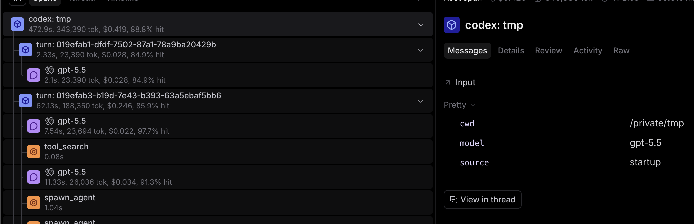

# Trace coding agents with hook events

## Overview

This document describes how coding agents that offer hook-based plugins should send data to support the creation of a tracing plugin.

For example, the Braintrust `trace-codex` plugin captures Codex hook events and creates traces that look like this:

[View this trace in Braintrust](https://www.braintrust.dev/app/Braintrust%20SDKs/p/andrew-coding-agent/trace?object_type=project_logs&object_id=ebabe4b7-25b2-4884-8d85-55fa6e2e6014&r=ed6f0665-4fd9-4f7b-ad8e-e928ec8421b1&s=ed6f0665-4fd9-4f7b-ad8e-e928ec8421b1)

Even if a coding agent does not care about tracing in particular, it's still beneficial to follow these guidelines: a plugin API that can support tracing can support every other potential plugin, because the nature of tracing requires all data used by the coding agent.

## Guidelines

Generally speaking, hook events should send:

- A millisecond-precise timestamp for each event (e.g. epoch time).
- Unique identifiers (e.g. UUIDs) so start/stop events can be paired and nested into a trace. In particular:
  - one for every session start;
  - one for every turn (a "turn" is a single user message to the coding agent plus the coding agent's response to it);
  - one for every operation that has a start and a stop (LLM call, tool use, web call, MCP call, subagent, etc.), shared between that operation's start and stop events so the pair can be matched.
- Every operation event should also carry the ID of the turn that spawned it (LLM call, tool use, web, MCP, subagent, etc.), so operations can be attributed back to their turn.
- A paired start/stop event for operations with a logical beginning and end. (A session start does not have a logical end, so it's a single event. A tool call would have a tool start and a tool end event.)
- Start/stop events for every LLM API call, with the full request and response bodies.
- Start/stop events for every tool, web, and MCP call made by the agent.
- A start/stop event for every turn.
- Subagents should push hook events in the same way the normal agent does (and sub-subagents as well, etc.), carrying the ID of the turn that spawned them per the rule above.
- A session end / shutdown hook. NOTE: sessions can be resumed, so this would not signal the definitive end of the session, but knowing when the process is complete allows plugins to flush background data.

Hook events must be delivered in order, and hooks must support a blocking mode (the agent waits for the hook to return before proceeding). Offering an additional async / non-blocking mode is fine.

Schema versioning on hook payloads is a nice-to-have — it lets consumers adapt to format changes gracefully — but it is not a dealbreaker.

Privacy and redaction of hook data (e.g. secrets or file contents that appear in LLM request/response bodies) is left to the coding agent and its plugins; this document does not prescribe an approach.

## Session transcript fallback

Some coding agents do not publish the required data for tracing, but provide session transcript files that contain enough of the above data. This is an acceptable workaround in most cases, but it's not a desired solution because transcripts do not have a reliable data format.
